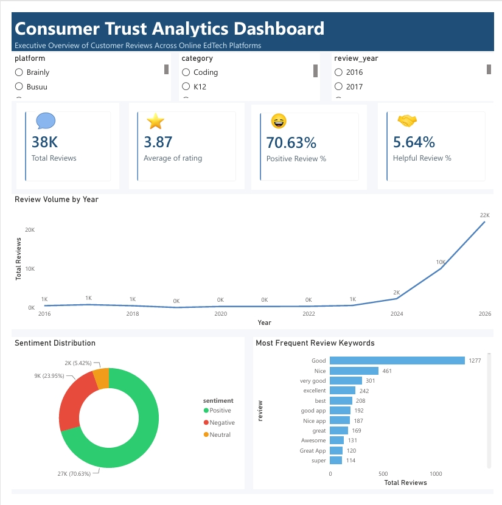
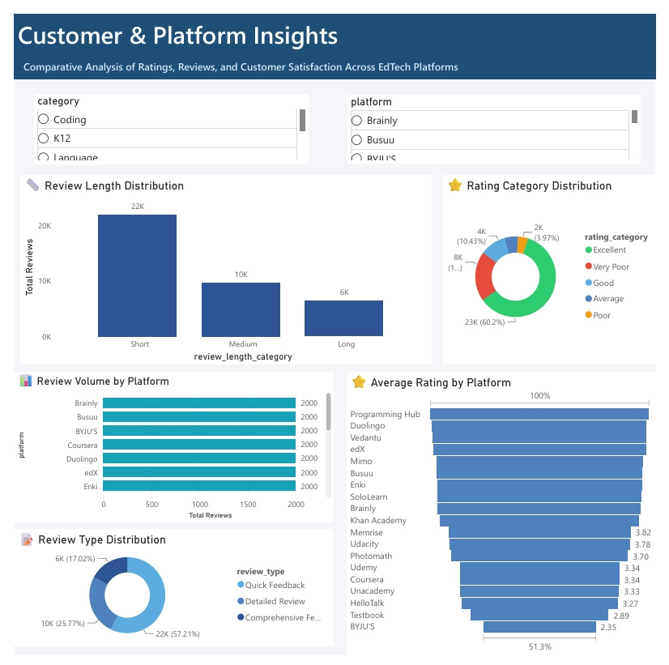
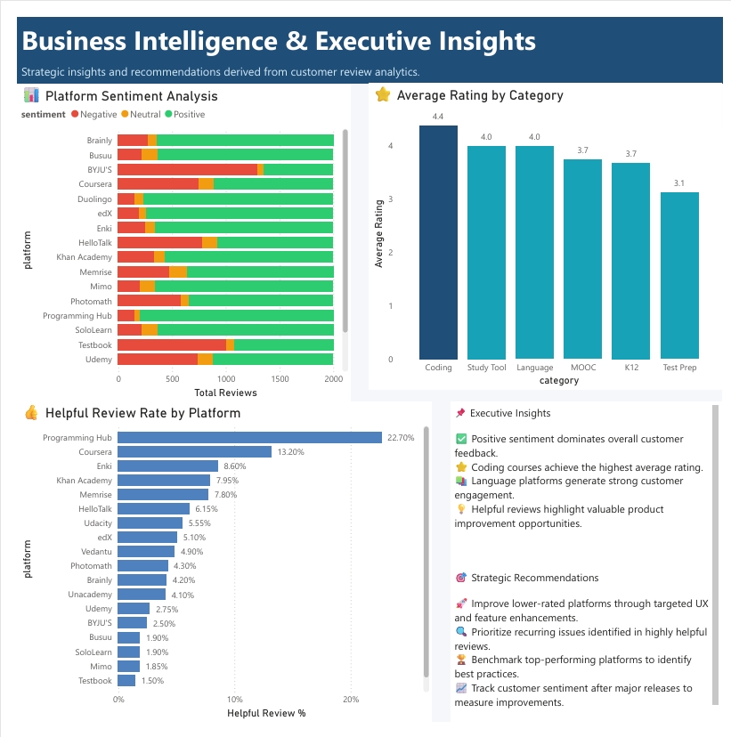

<!-- ========================================================= -->
<!--                    HERO SECTION                       -->
<!-- ========================================================= -->

<h1 align="center">📊 Consumer Trust Analytics</h1>

<h3 align="center">
A Data-Driven Analysis of Customer Complaints and Customer Satisfaction Across Online EdTech Platforms
</h3>

<p align="center">
An end-to-end <b>Business Intelligence</b> project that transforms customer reviews into actionable insights using
<b>Python</b>, <b>MySQL</b>, <b>SQL</b>, and <b>Power BI</b>.
</p>

<p align="center">


</p>

---

# 📌 Executive Summary

Customer reviews contain valuable insights into customer satisfaction, product quality, and consumer trust. However, extracting meaningful business intelligence from thousands of unstructured reviews requires a structured analytics workflow.

This project analyzes **37,999 customer reviews** collected from **19 major online EdTech platforms** and transforms them into actionable business insights through data preprocessing, exploratory analysis, feature engineering, SQL reporting, and interactive Power BI dashboards.

The project demonstrates an end-to-end Business Intelligence pipeline—from raw data preparation to executive-ready dashboards—using industry-standard analytics tools.

---

# 🚀 Project Highlights

| 📊 Metric | 📈 Value |
|-----------|---------:|
| Customer Reviews | **37,999** |
| EdTech Platforms | **19** |
| Python Notebooks | **4** |
| SQL Reports | **9** |
| Power BI Dashboards | **3** |
| Database | **MySQL** |

---

# 📊 Dashboard Showcase

The project includes three interactive Power BI dashboards designed for business stakeholders.

---

## 📈 Dashboard 1 — Customer Overview

<p align="center">
<a href="dashboard_images/dashboard01.png">

</a>
</p>

<p align="center">
<i>Figure 1. Customer Overview Dashboard (Click image to enlarge)</i>
</p>

Provides a high-level overview of customer reviews, platform distribution, review volume, and customer engagement across all EdTech platforms.

---

## ⭐ Dashboard 2 — Customer Satisfaction & Consumer Trust

<p align="center">
<a href="dashboard_images/dashboard02.png">

</a>
</p>

<p align="center">
<i>Figure 2. Customer Satisfaction & Consumer Trust Dashboard (Click image to enlarge)</i>
</p>

Visualizes customer ratings, sentiment, consumer trust metrics, helpful reviews, and platform performance to support strategic decision-making.

---

## ⚠️ Dashboard 3 — Customer Complaint Intelligence

<p align="center">
<a href="dashboard_images/dashboard03.png">

</a>
</p>

<p align="center">
<i>Figure 3. Customer Complaint Intelligence Dashboard (Click image to enlarge)</i>
</p>

Highlights complaint trends, customer pain points, review engagement, and improvement opportunities across platforms.

---

# 💼 Business Questions

This project answers several important business questions, including:

- Which EdTech platforms have the highest customer satisfaction?
- Which platforms generate the greatest consumer trust?
- What are the most common customer complaints?
- Which reviews provide the most valuable customer feedback?
- How do customer satisfaction and engagement vary across platforms?
- Which strategic improvements can enhance customer experience?

---

# 🛠️ Tech Stack

| Category | Technologies |
|-----------|--------------|
| Programming Language | Python |
| Data Analysis | Pandas, NumPy |
| Database | MySQL |
| Query Language | SQL |
| Data Visualization | Power BI |
| Development Environment | Jupyter Notebook |
| Version Control | Git & GitHub |
| IDE | Visual Studio Code |

---

# 🏗️ Project Workflow

```text
Raw Customer Reviews
          │
          ▼
Data Understanding
          │
          ▼
Data Cleaning & Preprocessing
          │
          ▼
Exploratory Data Analysis
          │
          ▼
Feature Engineering
          │
          ▼
MySQL Database
          │
          ▼
SQL Business Reports
          │
          ▼
Power BI Dashboards
          │
          ▼
Business Insights & Recommendations
```

---

# 📑 Table of Contents

- Executive Summary
- Dashboard Showcase
- Business Problem
- Project Objectives
- Repository Structure
- Dataset Overview
- Data Cleaning & Preprocessing
- Exploratory Data Analysis
- Feature Engineering
- MySQL Database Design
- SQL Business Reports
- Power BI Dashboard
- Business Insights
- Strategic Recommendations
- Installation
- Future Improvements
- Author


<!-- ========================================================= -->
<!--                BUSINESS PROBLEM & OBJECTIVES              -->
<!-- ========================================================= -->

# 🎯 Business Problem

Online EdTech platforms receive thousands of customer reviews every day. These reviews contain valuable information about customer satisfaction, product quality, support responsiveness, and recurring issues. However, because most reviews are unstructured text, extracting meaningful insights at scale is challenging.

Without a structured analytical workflow, organizations struggle to:

- Identify recurring customer complaints.
- Monitor customer satisfaction across platforms.
- Evaluate customer engagement and trust.
- Benchmark platform performance.
- Prioritize product and service improvements.

This project addresses these challenges by transforming raw customer reviews into structured business intelligence through data preprocessing, SQL analytics, and interactive Power BI dashboards.

---

# 🎯 Project Objectives

The primary goal of this project is to build a complete Business Intelligence solution for analyzing customer reviews from multiple online EdTech platforms.

### Project Objectives

- Collect and organize customer review data.
- Assess and improve data quality.
- Perform exploratory data analysis (EDA).
- Engineer business-focused analytical features.
- Design a relational MySQL database.
- Develop SQL reports to answer key business questions.
- Build interactive Power BI dashboards.
- Generate actionable business insights and recommendations.

---

# 📂 Repository Structure

```text
Consumer-Trust-Analytics/
│
├── dashboard/
│   └── consumer_trust_analytics.pbix
│
├── dashboard_images/
│   ├── dashboard01.png
│   ├── dashboard02.png
│   └── dashboard03.png
│
├── data/
│   ├── raw/
│   ├── processed/
│   └── featured/
│
├── notebooks/
│   ├── 01_Data_Understanding.ipynb
│   ├── 02_Data_Cleaning.ipynb
│   ├── 03_Exploratory_Data_Analysis.ipynb
│   └── 04_Feature_Engineering.ipynb
│
├── sql/
│   ├── 01_Create_Database.sql
│   ├── 02_Create_Table.sql
│   ├── 03_Load_Data.sql
│   ├── 04_Customer_Overview.sql
│   ├── 05_Customer_Satisfaction_Report.sql
│   ├── 06_Consumer_Trust_Report.sql
│   ├── 07_Customer_Complaint_Intelligence_Report.sql
│   ├── 08_Time_Trend_Report.sql
│   └── 09_Executive_Report.sql
│
├── src/
├── requirements.txt
├── README.md
└── .gitignore
```

---

<!-- ========================================================= -->
<!--                     DATASET OVERVIEW                      -->
<!-- ========================================================= -->

# 📂 Dataset Overview

The project analyzes customer reviews collected from **19 major online EdTech platforms**, covering a variety of learning categories including programming, language learning, professional development, and academic education.

The dataset combines **structured attributes** (ratings, review dates, helpful votes, platform information) with **unstructured customer review text**, making it well suited for Business Intelligence and customer analytics.

---

## 📊 Dataset Summary

| Attribute | Value |
|-----------|------:|
| Total Reviews | **37,999** |
| Platforms | **19** |
| Data Type | Structured + Text |
| Primary Language | English |
| Target Domain | Online EdTech |

---

## 📑 Dataset Features

| Feature | Description |
|----------|-------------|
| Platform | EdTech platform name |
| Category | Learning category |
| Rating | Customer rating (1–5) |
| Review | Customer review text |
| Review Date | Date the review was posted |
| Helpful Votes | Number of helpful votes |
| Developer Reply | Platform response to a review |
| Review Length | Length of the review |
| Sentiment | Engineered sentiment label |
| Review Type | Engineered review classification |
| Helpful Review | Helpful review indicator |
| Review Length Category | Short, Medium, or Long |
| Review Year | Year extracted from the review date |
| Review Month | Month extracted from the review date |
| Review Quarter | Quarter extracted from the review date |
| Rating Category | Descriptive rating group |

---

## 💡 Why This Dataset?

Customer reviews provide one of the richest sources of real-world business intelligence. By combining quantitative metrics with qualitative feedback, organizations can better understand customer expectations, identify recurring issues, evaluate platform performance, and make evidence-based decisions.

---

<!-- ========================================================= -->
<!--                 DATA CLEANING & PREPROCESSING             -->
<!-- ========================================================= -->

# 🧹 Data Cleaning & Preprocessing

Before analysis, the dataset underwent a structured preprocessing pipeline to ensure consistency, accuracy, and reliability.

The workflow focused on improving data quality and preparing the dataset for SQL reporting and Power BI visualization.

---

## 🔄 Data Cleaning Workflow

```text
Raw Dataset
      │
      ▼
Initial Inspection
      │
      ▼
Missing Value Analysis
      │
      ▼
Duplicate Detection
      │
      ▼
Data Type Validation
      │
      ▼
Text Standardization
      │
      ▼
Date Formatting
      │
      ▼
Quality Verification
      │
      ▼
Clean Dataset
```

---

## 🔧 Key Preprocessing Tasks

| Task | Purpose |
|------|---------|
| Missing Value Analysis | Handle incomplete records |
| Duplicate Detection | Remove duplicate reviews |
| Data Type Validation | Ensure correct formats |
| Text Standardization | Clean and normalize text |
| Date Formatting | Enable time-series analysis |
| Quality Verification | Validate the final dataset |

---

## ✅ Outcome

The preprocessing stage produced a clean, analysis-ready dataset that served as the foundation for:

- Exploratory Data Analysis (EDA)
- Feature Engineering
- MySQL Database Design
- SQL Business Reports
- Power BI Dashboards

This ensured that all subsequent analyses and visualizations were based on reliable, high-quality data.


<!-- ========================================================= -->
<!--         EXPLORATORY DATA ANALYSIS & FEATURE ENGINEERING   -->
<!-- ========================================================= -->

# 📊 Exploratory Data Analysis (EDA)

Exploratory Data Analysis (EDA) was conducted to understand the structure of the dataset, identify patterns, detect anomalies, and uncover relationships between customer reviews, ratings, and platform performance.

The analysis established a strong foundation for feature engineering, SQL reporting, and dashboard development.

---

## 🎯 EDA Objectives

The exploratory analysis focused on answering key business questions, including:

- How are customer reviews distributed across platforms?
- What is the overall customer satisfaction level?
- Which platforms receive the highest review volume?
- How engaged are customers with review content?
- Do developer responses influence customer engagement?
- How does review length vary across platforms?

---

## 📈 Key Analyses Performed

| Analysis | Business Purpose |
|-----------|------------------|
| Platform Distribution | Compare review activity across EdTech platforms |
| Rating Distribution | Measure customer satisfaction |
| Review Volume Analysis | Identify the most active platforms |
| Helpful Votes Analysis | Understand customer engagement |
| Developer Response Analysis | Evaluate platform responsiveness |
| Review Length Analysis | Explore customer feedback behavior |
| Time-Based Analysis | Identify seasonal and long-term trends |

---

## 💡 Key Observations

The exploratory analysis revealed several important patterns:

- Customer review activity varies significantly across platforms.
- Highly rated platforms generally receive more positive customer sentiment.
- Longer reviews often contain more detailed and actionable feedback.
- Developer responses are relatively uncommon but may improve customer trust.
- Customer engagement differs considerably between platforms, indicating varying levels of user satisfaction and interaction.

These findings informed the feature engineering process and guided the design of SQL reports and Power BI dashboards.

---

# ⚙️ Feature Engineering

To enrich the original dataset and improve business reporting, several new analytical features were created from the raw review data.

These engineered features simplify reporting, enable advanced filtering, and support meaningful business insights.

---

## 🎯 Objectives

Feature engineering was performed to:

- Improve analytical flexibility.
- Enable customer segmentation.
- Simplify dashboard filtering.
- Support SQL aggregation and reporting.
- Enhance executive-level decision making.

---

## 🛠️ Engineered Features

| Feature | Description | Business Value |
|----------|-------------|----------------|
| **Sentiment** | Classifies reviews as Positive, Neutral, or Negative | Measures customer perception |
| **Review Type** | Categorizes reviews by tone and content | Simplifies review segmentation |
| **Helpful Review** | Flags reviews with high helpful vote counts | Identifies valuable customer feedback |
| **Review Length** | Calculates the number of characters in each review | Measures customer engagement |
| **Review Length Category** | Groups reviews into Short, Medium, and Long | Enables behavioral analysis |
| **Rating Category** | Converts numerical ratings into descriptive groups | Improves dashboard readability |
| **Review Year** | Extracted from the review date | Supports yearly trend analysis |
| **Review Month** | Extracted from the review date | Enables monthly reporting |
| **Review Quarter** | Extracted from the review date | Supports quarterly business analysis |

---

## 🔄 Feature Engineering Workflow

```text
Raw Reviews
      │
      ▼
Text Processing
      │
      ▼
Sentiment Classification
      │
      ▼
Review Categorization
      │
      ▼
Helpful Review Detection
      │
      ▼
Date Feature Extraction
      │
      ▼
Business Feature Creation
      │
      ▼
Final Analytics Dataset
```

---

## 📌 Business Impact

The engineered features transformed raw customer reviews into structured business metrics that could be directly consumed by SQL reports and Power BI dashboards.

These enhancements enabled:

- Better customer segmentation.
- Faster business reporting.
- Improved dashboard interactivity.
- Richer trend analysis.
- More actionable business insights.

The final engineered dataset became the central data source for all downstream analytics, including SQL reporting and interactive dashboard development.


<!-- ========================================================= -->
<!--             MYSQL DATABASE & SQL BUSINESS REPORTS         -->
<!-- ========================================================= -->

# 🗄️ MySQL Database Design

After preprocessing and feature engineering, the cleaned dataset was imported into a **MySQL relational database** to support structured querying, business reporting, and dashboard development.

Using SQL enabled efficient aggregation of nearly **38,000 customer reviews**, transforming raw data into meaningful business insights.

---

## 🎯 Database Objectives

The database was designed to:

- Store cleaned customer review data.
- Enable fast analytical queries.
- Support reusable SQL reports.
- Serve as the data source for Power BI.
- Provide scalable business reporting.

---

## 🏛️ Database Schema

```text
consumer_trust_analytics
│
└── reviews
      ├── platform
      ├── category
      ├── rating
      ├── review
      ├── review_date
      ├── thumbs_up
      ├── reply_content
      ├── review_length
      ├── sentiment
      ├── review_type
      ├── helpful_review
      ├── review_length_category
      ├── review_year
      ├── review_month
      ├── review_quarter
      └── rating_category
```

---

## 🔄 Data Loading Pipeline

```text
CSV Dataset
      │
      ▼
Python (Pandas)
      │
      ▼
Data Cleaning
      │
      ▼
Feature Engineering
      │
      ▼
SQLAlchemy
      │
      ▼
MySQL Database
      │
      ▼
SQL Business Reports
      │
      ▼
Power BI Dashboards
```

---

## 📦 Database Creation Process

The SQL workflow was organized into separate scripts to improve maintainability and reproducibility.

| SQL Script | Purpose |
|------------|---------|
| **01_Create_Database.sql** | Create the project database |
| **02_Create_Table.sql** | Define the reviews table schema |
| **03_Load_Data.sql** | Import the engineered dataset into MySQL |

This modular approach makes the project easy to reproduce and extend with additional datasets.

---

# 📋 SQL Business Reports

Once the database was created, SQL was used to answer key business questions through a series of analytical reports.

These reports aggregate customer review data into actionable insights for stakeholders and decision-makers.

---

## 📊 SQL Reporting Overview

| Report | Business Question |
|---------|-------------------|
| Customer Overview | What does the overall customer landscape look like? |
| Customer Satisfaction | Which platforms achieve the highest customer satisfaction? |
| Consumer Trust | Which factors influence customer trust? |
| Complaint Intelligence | What are the most common customer issues? |
| Time Trend Analysis | How have reviews changed over time? |
| Executive Report | What are the key KPIs for decision-makers? |

---

## 📈 Report 1 — Customer Overview

### 🎯 Purpose

Provide a high-level summary of customer activity across all EdTech platforms.

### 🔍 Business Questions

- Which platforms receive the highest review volume?
- How are reviews distributed across categories?
- What is the average customer rating?
- How engaged are customers?

### 💼 Business Value

Helps stakeholders quickly understand overall platform performance and customer engagement.

---

## ⭐ Report 2 — Customer Satisfaction

### 🎯 Purpose

Evaluate customer satisfaction using review ratings and sentiment analysis.

### 🔍 Business Questions

- Which platforms have the highest average ratings?
- Which platforms receive the most positive reviews?
- Where is customer satisfaction declining?

### 💼 Business Value

Supports product improvement initiatives and customer experience strategies.

---

## 🤝 Report 3 — Consumer Trust

### 🎯 Purpose

Analyze indicators that contribute to customer trust and platform credibility.

### 🔍 Business Questions

- Do developer responses influence customer perception?
- Which platforms receive the most helpful reviews?
- How does engagement relate to customer satisfaction?

### 💼 Business Value

Provides insight into customer confidence and platform reputation.

---

## ⚠️ Report 4 — Customer Complaint Intelligence

### 🎯 Purpose

Identify recurring customer complaints and operational challenges.

### 🔍 Business Questions

- What issues appear most frequently?
- Which platforms receive the highest proportion of negative reviews?
- Where should improvement efforts be focused?

### 💼 Business Value

Enables proactive issue resolution and supports customer retention strategies.

---

## 📅 Report 5 — Time Trend Analysis

### 🎯 Purpose

Track customer review activity over time.

### 🔍 Business Questions

- How has customer engagement evolved?
- Are there seasonal patterns?
- How have ratings changed across months and years?

### 💼 Business Value

Supports forecasting, trend monitoring, and strategic planning.

---

## 📊 Report 6 — Executive Decision Support

### 🎯 Purpose

Consolidate the most important KPIs into a single report for business leaders.

### 📌 Key Metrics

- Total Reviews
- Average Rating
- Customer Satisfaction
- Consumer Trust
- Helpful Reviews
- Platform Performance
- Complaint Trends

### 💼 Business Value

Provides executives with a concise, data-driven summary for strategic decision-making.

---

# 💡 Key SQL Skills Demonstrated

This project showcases practical SQL skills used in real-world business intelligence workflows, including:

- Database Design
- Data Definition Language (DDL)
- Data Loading and Management
- Data Aggregation
- Joins and Filtering
- Grouping and Sorting
- KPI Reporting
- Business Intelligence Reporting

These SQL reports form the analytical backbone of the Power BI dashboards, ensuring that visualizations are built on reliable and well-structured business metrics.


<!-- ========================================================= -->
<!--             POWER BI DASHBOARD & BUSINESS INSIGHTS        -->
<!-- ========================================================= -->

# 📊 Power BI Dashboard

The final stage of this project was the development of an interactive **Power BI dashboard** that transforms SQL outputs into intuitive visual reports for business stakeholders.

The dashboard enables users to explore customer satisfaction, consumer trust, complaint trends, and platform performance through interactive filters and KPIs.

---

## 🎯 Dashboard Objectives

The Power BI dashboard was designed to:

- Monitor customer satisfaction across EdTech platforms.
- Compare platform performance using key metrics.
- Identify recurring customer complaints.
- Track customer engagement over time.
- Support executive decision-making with interactive visualizations.

---

# 📈 Dashboard 1 — Customer Overview

<p align="center">
<a href="dashboard_images/dashboard01.png">

</a>
</p>

<p align="center">
<i>Figure 1. Customer Overview Dashboard (Click image to enlarge)</i>
</p>

### 🎯 Purpose

Provide a high-level overview of customer activity across all platforms.

### 📌 Dashboard Highlights

- Total customer reviews
- Average customer rating
- Platform comparison
- Review volume by platform
- Customer engagement metrics
- Interactive platform filtering

### 💼 Business Value

This dashboard provides decision-makers with an immediate understanding of customer activity and platform performance, helping prioritize areas that require attention.

---

# ⭐ Dashboard 2 — Customer Satisfaction & Consumer Trust

<p align="center">
<a href="dashboard_images/dashboard02.png">

</a>
</p>

<p align="center">
<i>Figure 2. Customer Satisfaction & Consumer Trust Dashboard (Click image to enlarge)</i>
</p>

### 🎯 Purpose

Evaluate customer satisfaction and measure consumer trust across platforms.

### 📌 Dashboard Highlights

- Average rating analysis
- Sentiment distribution
- Positive vs. negative reviews
- Helpful review analysis
- Customer trust indicators
- Platform benchmarking

### 💼 Business Value

This dashboard helps organizations identify high-performing platforms, understand customer perception, and monitor trust-related metrics that influence long-term customer retention.

---

# ⚠️ Dashboard 3 — Customer Complaint Intelligence

<p align="center">
<a href="dashboard_images/dashboard03.png">

</a>
</p>

<p align="center">
<i>Figure 3. Customer Complaint Intelligence Dashboard (Click image to enlarge)</i>
</p>

### 🎯 Purpose

Identify recurring customer issues and uncover opportunities for service improvement.

### 📌 Dashboard Highlights

- Complaint trends
- Negative review analysis
- Review length distribution
- Customer engagement patterns
- Platform comparison
- Time-based complaint tracking

### 💼 Business Value

The dashboard enables product teams and customer support managers to identify recurring issues, prioritize improvements, and enhance the overall customer experience.

---

# 💡 Key Business Insights

The analysis uncovered several important findings that can support strategic decision-making.

### 📈 Customer Satisfaction

- Customer satisfaction varies considerably across platforms.
- Higher-rated platforms generally receive more positive customer sentiment.
- Consistently high ratings are associated with stronger customer trust.

---

### 🤝 Consumer Trust

- Helpful reviews provide valuable signals of customer engagement.
- Platforms with responsive developer interactions tend to foster stronger customer confidence.
- Trust is influenced by both product quality and the quality of customer support.

---

### ⚠️ Customer Complaints

- Negative reviews reveal recurring issues that may affect customer retention.
- Complaint patterns differ between platforms, indicating unique operational challenges.
- Addressing common pain points can significantly improve user satisfaction.

---

### 📅 Customer Trends

- Review activity changes over time, highlighting shifts in customer engagement.
- Seasonal variations can influence review volume and customer sentiment.
- Long-term trend analysis supports proactive business planning.

---

# 📌 Strategic Recommendations

Based on the analytical findings, the following recommendations can help improve customer satisfaction and strengthen consumer trust.

## 🚀 Enhance Customer Support

- Respond promptly to customer concerns.
- Reduce response times for negative reviews.
- Encourage constructive dialogue with customers.

---

## ⭐ Improve Product Quality

- Prioritize recurring issues identified in complaint analysis.
- Use customer feedback to guide product enhancements.
- Continuously monitor satisfaction metrics.

---

## 🤝 Strengthen Consumer Trust

- Encourage detailed customer reviews.
- Increase transparency in customer communication.
- Highlight resolved issues to build credibility.

---

## 📊 Monitor Business Performance

- Track KPIs regularly using interactive dashboards.
- Compare platform performance over time.
- Use trend analysis to identify emerging opportunities and risks.

---

# 🏆 Project Outcomes

This project demonstrates the complete lifecycle of a Business Intelligence solution, from raw customer review data to executive-ready dashboards.

### Skills Demonstrated

- Data Cleaning & Preprocessing
- Exploratory Data Analysis (EDA)
- Feature Engineering
- Relational Database Design
- SQL Business Reporting
- KPI Development
- Power BI Dashboard Design
- Business Storytelling
- Data Visualization
- Analytical Problem Solving

The final solution delivers actionable insights that enable organizations to better understand customer behavior, improve service quality, and make data-driven business decisions.

<!-- ========================================================= -->
<!--               INSTALLATION & GETTING STARTED              -->
<!-- ========================================================= -->

# 🚀 Getting Started

Follow these steps to set up and explore the project locally.

## 📋 Prerequisites

Make sure the following tools are installed:

- Python 3.10+
- MySQL Server 8.0+
- Power BI Desktop
- Git

---

## 📥 Clone the Repository

```bash
git clone https://github.com/<your-github-username>/Consumer-Trust-Analytics.git
```

```bash
cd Consumer-Trust-Analytics
```

---

## 📦 Install Python Dependencies

```bash
pip install -r requirements.txt
```

---

## 🗄️ Create the Database

> **Note:** Before running `load_to_mysql.py`, replace `<YOUR_MYSQL_PASSWORD>` in the `MYSQL_PASSWORD` variable with your local MySQL password.

Run the SQL scripts in the following order:

```text
01_Create_Database.sql
        ↓
02_Create_Table.sql
        ↓
03_Load_Data.sql
        ↓
04_Customer_Overview.sql
        ↓
05_Customer_Satisfaction_Report.sql
        ↓
06_Consumer_Trust_Report.sql
        ↓
07_Customer_Complaint_Intelligence_Report.sql
        ↓
08_Time_Trend_Report.sql
        ↓
09_Executive_Report.sql
```
```

---

## 📊 Explore the Analysis

Run the notebooks sequentially:

```text
01_Data_Understanding.ipynb
        ↓
02_Data_Cleaning.ipynb
        ↓
03_Exploratory_Data_Analysis.ipynb
        ↓
04_Feature_Engineering.ipynb
```

---

## 📈 Open the Dashboard

Launch

```text
dashboard/consumer_trust_analytics.pbix
```

using Power BI Desktop.

---

<!-- ========================================================= -->
<!--                     PROJECT DELIVERABLES                  -->
<!-- ========================================================= -->

# 📦 Project Deliverables

The repository contains:

| Deliverable | Description |
|-------------|-------------|
| 📓 Jupyter Notebooks | Data understanding, cleaning, EDA, and feature engineering |
| 🗄️ MySQL Database | Structured analytical database |
| 📋 SQL Reports | Business intelligence queries and KPI reports |
| 📊 Power BI Dashboard | Interactive executive dashboards |
| 📁 Processed Dataset | Clean, feature-engineered dataset |
| 📄 Documentation | Complete project documentation |

---

<!-- ========================================================= -->
<!--                     SKILLS DEMONSTRATED                  -->
<!-- ========================================================= -->

# 🛠️ Skills Demonstrated

This project showcases practical skills across the full data analytics lifecycle.

### Programming

- Python
- SQL

### Data Analysis

- Pandas
- NumPy
- Exploratory Data Analysis (EDA)
- Feature Engineering

### Database

- MySQL
- Database Design
- Data Modeling
- SQL Query Optimization

### Business Intelligence

- Power BI
- KPI Development
- Dashboard Design
- Data Visualization

### Analytics

- Customer Analytics
- Consumer Trust Analysis
- Customer Satisfaction Analysis
- Business Reporting
- Executive Reporting

### Professional Skills

- Analytical Thinking
- Business Storytelling
- Data-Driven Decision Making
- Problem Solving
- End-to-End Project Development

---

<!-- ========================================================= -->
<!--                  FUTURE IMPROVEMENTS                     -->
<!-- ========================================================= -->

# 🔮 Future Improvements

Potential enhancements include:

- Apply Natural Language Processing (NLP) for deeper sentiment analysis.
- Develop predictive models for customer satisfaction.
- Build automated ETL pipelines for continuous data updates.
- Integrate real-time review data using APIs.
- Deploy interactive dashboards through the Power BI Service.
- Expand the project to include additional EdTech platforms.
- Create a web application for interactive analytics.

---

<!-- ========================================================= -->
<!--                       LICENSE                            -->
<!-- ========================================================= -->

# 📜 License

This project is licensed under the **MIT License**.

Feel free to use, modify, and share this project with proper attribution.

---

<!-- ========================================================= -->
<!--                         AUTHOR                           -->
<!-- ========================================================= -->


# 👩‍💻 Author

**Kavya Chauhan**

Aspiring Data Scientist | Exploring AI, ML & Analytics

### Connect with me

- **GitHub:** https://github.com/mee-sha
- **LinkedIn:** https://www.linkedin.com/in/kavya-chauhan-a57401291/

⭐ If you found this project helpful, consider giving it a star on GitHub!